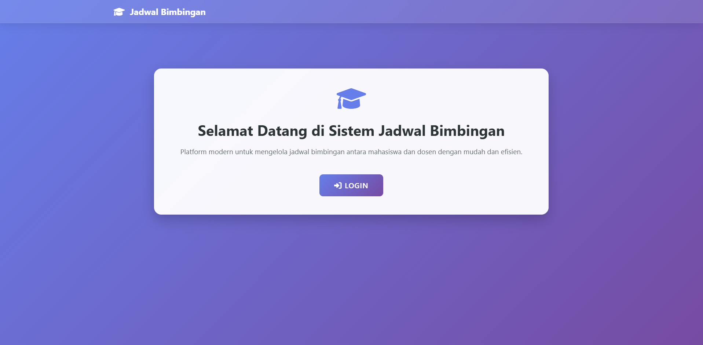
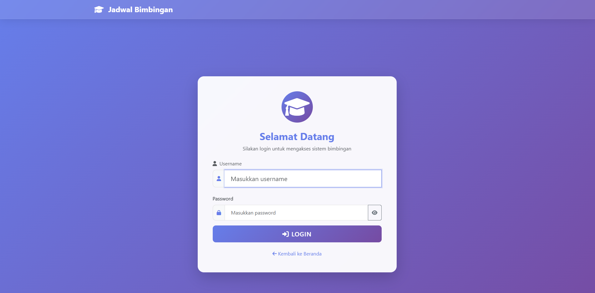
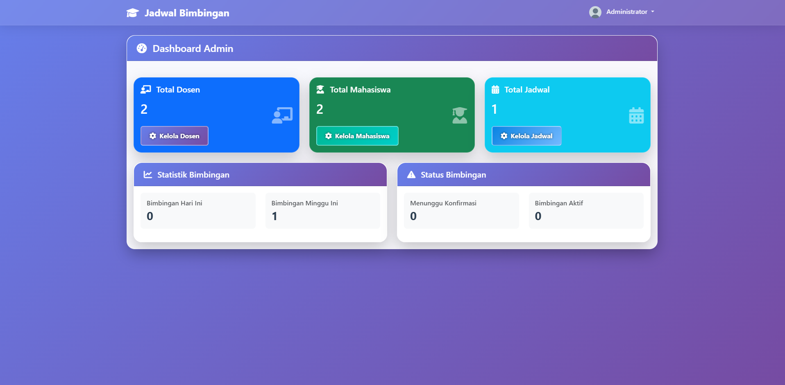
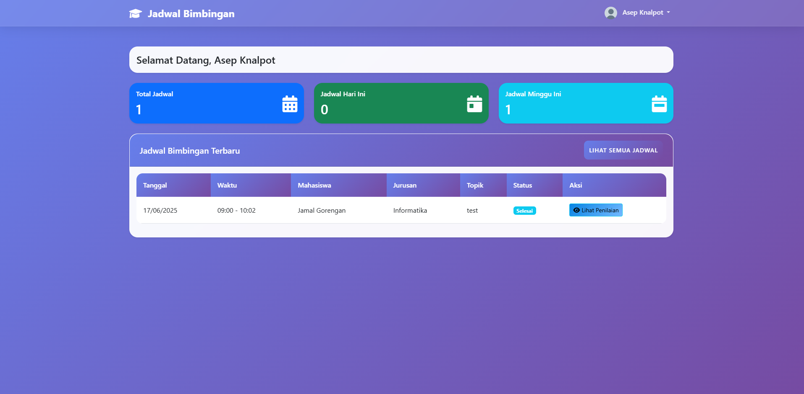
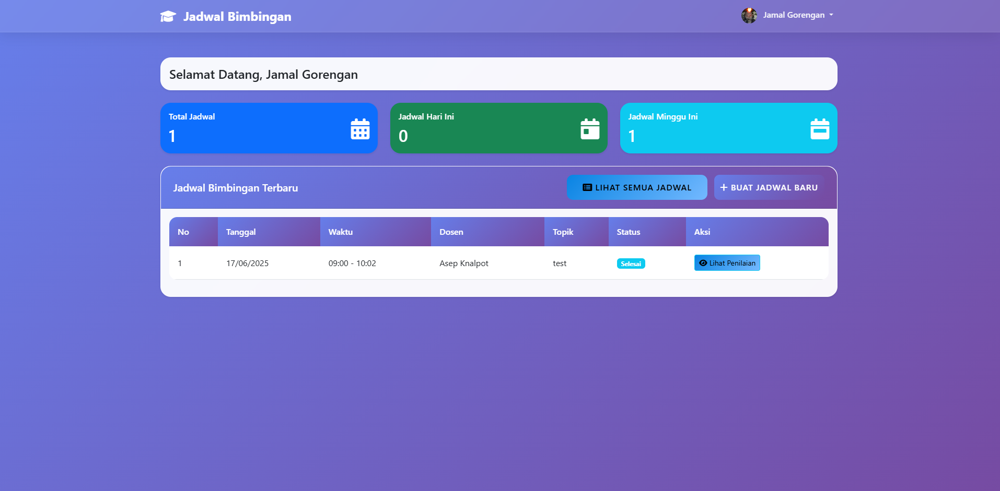

# 🗓️ JadwalBimbinganMahasiswa

[](https://laravel.com)
[](https://php.net)
[](https://mysql.com)
[](https://getbootstrap.com)

<div align="center">



Aplikasi berbasis web untuk mengatur dan mengelola **jadwal bimbingan mahasiswa** antara dosen dan mahasiswa secara terstruktur dan efisien. Dibuat sebagai solusi digital untuk memudahkan pengaturan jadwal dan dokumentasi proses bimbingan.

[](https://github.com/Cryztalzz/JadwalBimbinganMahasiswa/stargazers)
[](https://github.com/Cryztalzz/JadwalBimbinganMahasiswa/network/members)

</div>

---

## 👥 Anggota Kelompok

<div align="center">

| Nama | NIM |
|------|-----|
| Gregorius Alfa Putra   | 235314015 |
| Yudha Pramudya         | 235314021 |
| Rafael Mahesa Sakti    | 235314033 |
| Bradley aditya pasewang| 235314034 |

</div>

---

## ✨ Fitur Utama

<div align="center">

| Fitur | Deskripsi |
|-------|-----------|
| 🔐 Autentikasi | Sistem login untuk admin, dosen, dan mahasiswa |
| 📅 Manajemen Jadwal | Tambah, ubah, dan hapus jadwal bimbingan |
| 📊 Dashboard | Melihat daftar bimbingan aktif dan riwayat |
| 📝 Pengajuan | Formulir pengajuan bimbingan oleh mahasiswa |
| 👥 Manajemen User | Pengelolaan data pengguna dan jadwal oleh admin |

</div>

---

## 🛠️ Teknologi yang Digunakan

<div align="center">

| Kategori | Teknologi |
|----------|-----------|
| Framework | Laravel (PHP) |
| Database | MySQL |
| Frontend | Blade templating, Bootstrap |
| Version Control | Git & GitHub |

</div>

---

## 🚀 Instalasi

> ⚠️ **Prasyarat**: Pastikan PHP, Composer, dan MySQL sudah terinstal sebelum memulai.

1. **Clone repository**
   ```bash
   git clone https://github.com/Cryztalzz/JadwalBimbinganMahasiswa.git
   cd JadwalBimbinganMahasiswa
   ```

2. **Install dependensi**
   ```bash
   composer install
   ```

3. **Konfigurasi environment**
   ```bash
   cp .env.example .env
   php artisan key:generate
   ```

4. **Setup database**
   ```env
   DB_DATABASE=jadwal_bimbingan
   DB_USERNAME=root
   DB_PASSWORD=
   ```

5. **Jalankan migrasi dan seeder**
   ```bash
   php artisan migrate --seed
   ```

6. **Jalankan aplikasi**
   ```bash
   php artisan serve
   ```

> 🌐 Aplikasi akan berjalan di `http://127.0.0.1:8000` atau `http://localhost:8000`

---

## 📁 Struktur Direktori

```
app/
├── Http/
│   ├── Controllers/    # Controller untuk menangani request
│   └── Middleware/     # Middleware untuk autentikasi dan otorisasi
├── Models/             # Model untuk interaksi dengan database
routes/
├── web.php            # Definisi route aplikasi
resources/
├── views/             # Template Blade
├── js/                # File JavaScript
├── css/               # File CSS
```

---

## 🖼️ Screenshot Tampilan

<div align="center">


*Welcome Page*


*Login Page*


*Admin Dashboard*


*Dosen Dashboard*


*Mahasiswa Dashboard*

</div>
